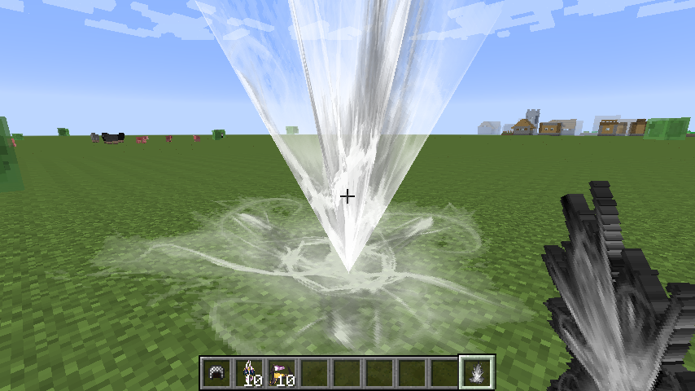
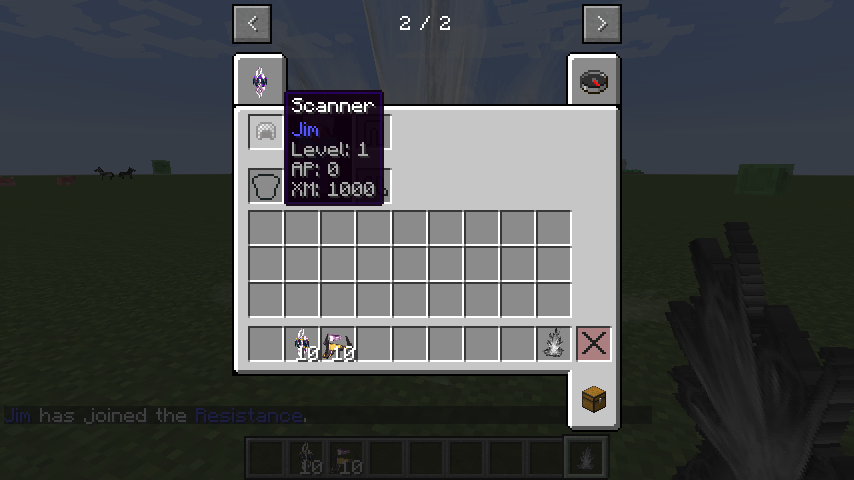
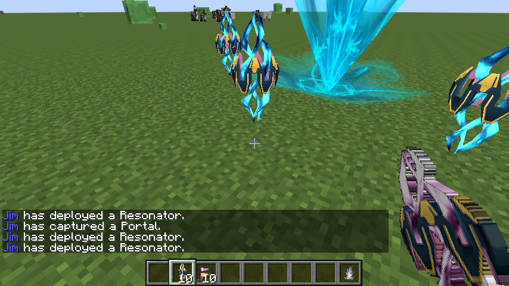
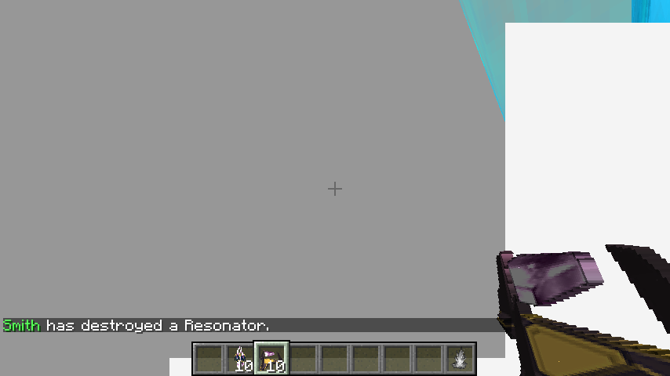
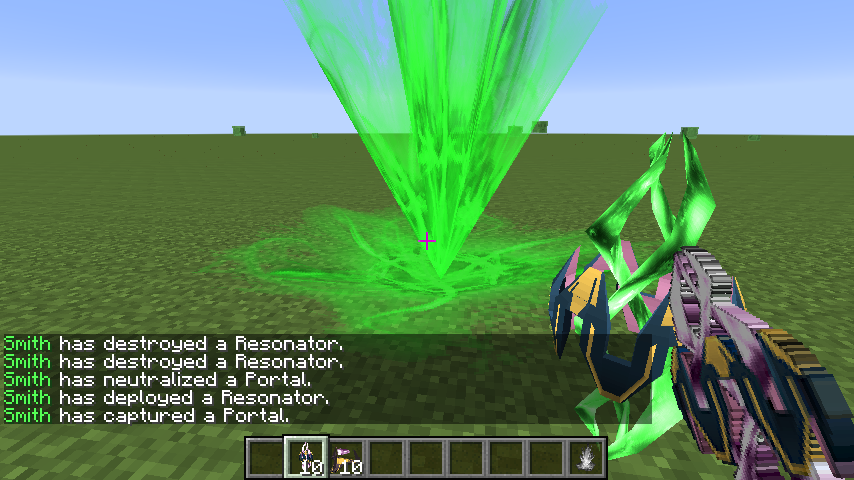

# IngressCraft

[](http://i.evshiron.info:8080/job/IngressCraft/)

A whim of making Ingress in MineCraft 1.7.10 with Forge.

Recently I am busy preparing for final exams, plus I have met some problems implementing Link and Linking. Let me take a rest, hopefully not too long :)

## Brief

This project is developed by @evshiron and @orz3969 on 2015 Unique Hack Day, as a gift for all Ingress agents joining that event. Many thanks to @orz3969.

## Resources

This project includes some resource files from ingress.apk, and most shaders are modified to fit this project. Niantic Labs owns those files.

## Setup

```

git clone https://github.com/evshiron/IngressCraft.git
cd IngressCraft
./gradlew setupDecompWorkspace --refresh-dependencies
./gradlew genIntellijRuns

```

## Build

```

git clone https://github.com/evshiron/IngressCraft.git
cd IngressCraft
./gradlew build

```

## Directives

A Portal is an Entity that accepts left click (Hack), right click with hand (Inspect, and further linking).

A Resonator is an Item that can be deployed right click around a Portal, or be recycled by right hold.

An XMPBurster can be fired by right click, damaging Resonators around, or be recycled by right hold.

A Mod can be deployed by left click on a Portal, or be recycled by right hold.

A Power Cube?

## TODO

* Hack, cool down and burn out.
* Link and Control Field.
  * Data store and visual effects.
  * Power, level and range.
* Safe places to store data.
* Prevent Links from going through solid blocks.
* Fix deployed Resonators' position.

## Screenshots











## References

* [Basic Modding (1.7) - Minecraft Mods & Modding by BedrockMiner](http://bedrockminer.jimdo.com/modding-tutorials/basic-modding-1-7/)
* [[1.7.2] Forge | Add new Block, Item, Entity, AI, Creative tab, Language localization, Block textures, Side textures - Mapping and Modding Tutorials - Mapping and Modding - Minecraft Forum - Minecraft Forum](http://www.minecraftforum.net/forums/mapping-and-modding/mapping-and-modding-tutorials/1571558-1-7-2-forge-add-new-block-item-entity-ai-creative)
* [GLSL Shaders with LWJGL - LWJGL](http://wiki.lwjgl.org/wiki/GLSL_Shaders_with_LWJGL)
* [DeviateFish/ingress-model-viewer](https://github.com/DeviateFish/ingress-model-viewer)
* [Technical Q&A QA1679: Deprecated built-in variables in GLSL Shaders](https://developer.apple.com/library/ios/qa/qa1679/_index.html)
* [Basic GUI - Minecraft Forge](http://www.minecraftforge.net/wiki/Basic_GUI)
* [[1.4.7][forge]Blaueseichoern's GUI Tutorial - Tutorials - Archive - Minecraft Forum - Minecraft Forum](http://www.minecraftforum.net/forums/archive/tutorials/931088-1-4-7-forge-blaueseichoerns-gui-tutorial)
* [GuiScrollingList (Forge API)](http://cmicro.github.io/NeatCraft/forge-javadoc/)
* [[solved]EntityFX Movements](http://www.minecraftforge.net/forum/index.php?topic=30868.0)

## Credits

  * `evshiron@github`
  * `orz3969@github`
  * Niantic Labs

## License

The MIT License

Permission is hereby granted, free of charge, to any person obtaining a copy of this software and associated documentation files (the "Software"), to deal in the Software without restriction, including without limitation the rights to use, copy, modify, merge, publish, distribute, sublicense, and/or sell copies of the Software, and to permit persons to whom the Software is furnished to do so, subject to the following conditions:

The above copyright notice and this permission notice shall be included in all copies or substantial portions of the Software.

THE SOFTWARE IS PROVIDED "AS IS", WITHOUT WARRANTY OF ANY KIND, EXPRESS OR IMPLIED, INCLUDING BUT NOT LIMITED TO THE WARRANTIES OF MERCHANTABILITY, FITNESS FOR A PARTICULAR PURPOSE AND NONINFRINGEMENT. IN NO EVENT SHALL THE AUTHORS OR COPYRIGHT HOLDERS BE LIABLE FOR ANY CLAIM, DAMAGES OR OTHER LIABILITY, WHETHER IN AN ACTION OF CONTRACT, TORT OR OTHERWISE, ARISING FROM, OUT OF OR IN CONNECTION WITH THE SOFTWARE OR THE USE OR OTHER DEALINGS IN THE SOFTWARE.
